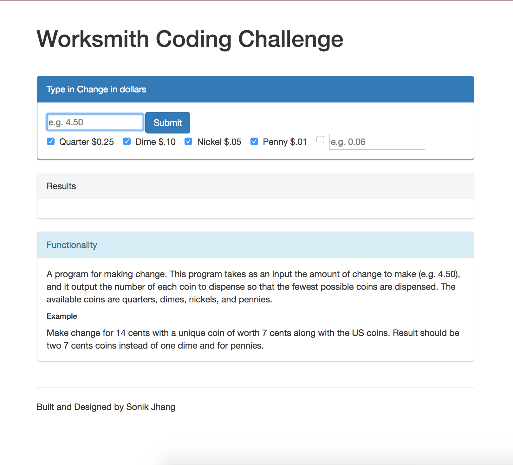

# Worksmith Coding Challenge

## Simple Make Change application

A program for making change. This program takes as an input the amount of change to make (e.g.   4.50), and it output the number of each coin to dispense so that the fewest possible coins are dispensed. The available coins are quarters, dimes, nickels, and pennies.

## Instructions

1. Clone the repo
2. Double click *index.html* from the directory
3. Type in desired change amount in *dollars*
4. Press *Submit* !
(optional)
5. Type in different cents value for fun or uncheck boxes to see different results!

### Improvements

makeChange function implemented right now immediately uses the biggest coin possible. This function will not properly work for example like $.14 with a unique coin of worth $.07 along with other standard US coins.
